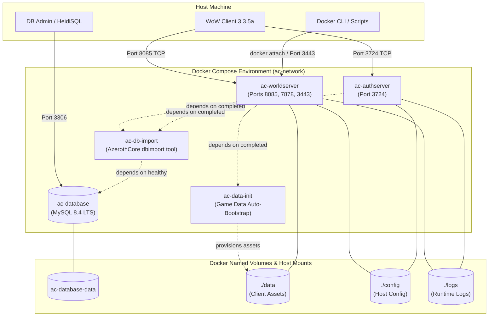

# AzerothCore WotLK (Conquest of Azeroth) - Docker Repack

A clean, reproducible, self-contained Docker-based server environment and repack for **AzerothCore WotLK** featuring the **Conquest of Azeroth (CoA)** custom class engine.

---

## 📖 Project Overview

This project provides a modern, containerized repack infrastructure for running an AzerothCore 3.3.5a World of Warcraft server with Conquest of Azeroth compatibility modules. Built from source using multi-stage Docker builds, it isolates build tools from runtime services, encapsulates service dependencies, and guarantees consistent behavior across developer and production host machines.

### Purpose

Traditional World of Warcraft private-server repacks are distributed as monolithic zip archives containing pre-extracted Windows binaries, embedded MySQL executables, and static batch files. While simple to launch on Windows, they suffer from portability issues, configuration drift, security vulnerabilities from outdated database engines, and immense difficulty when tracking upstream source updates.

**CoA-Docker** re-envisions the repack concept around Docker and Docker Compose:
- **Build from Source:** Produces optimized, reproducible Linux container images directly from the Git source tree.
- **Upstream Cleanliness:** Keeps the AzerothCore source decoupled via Git submodules, enabling simple tracking of upstream fixes.
- **Isolated Runtimes:** Minimalist, hardened runtime containers without compiler toolchains.
- **Persistent Data:** Database storage and server logs persist on managed Docker volumes independent of container lifecycles.
- **Turnkey Orchestration:** Single-command orchestration of Database, Migration/Import tool, Authentication Server, and World Server.

---

## 🚦 Current Status (Phase 2 Complete)

> [!IMPORTANT]
> **Phase 2: Game Data Integration Complete**  
> All client game assets (DBCs, terrain maps, collision vmaps, cinematic cameras, and Ascension custom DBCs) have been integrated and verified with `ac-worldserver`.
> 
> **Phase 3 (Next Phase):**
> - Production `.conf` overrides
> - World database gameplay content baseline
> - Account creation automation and realm network configuration

---

## ⚙️ System Requirements

### Software Prerequisites
- **Docker Engine:** Version 24.0+ (Docker Desktop on Windows/macOS or Docker CE on Linux)
- **Docker Compose:** Version 2.20+ (Compose v2 syntax support)
- **Git:** Version 2.30+ (with submodule support)

### Hardware Expectations
- **CPU:** Minimum 2 physical cores (4+ cores recommended for parallel compilation).
- **Memory (RAM):**
  - *Build Time:* 8 GB RAM minimum (compiling Clang/C++ with LTO/PCH requires ~4-8 GB peak).
  - *Runtime:* 4 GB RAM minimum for database, authserver, and worldserver. 8 GB+ recommended once full world maps and vmaps are loaded in later phases.
- **Disk Storage:** 25 GB free space (Docker images, BuildKit compiler cache, MySQL storage, and room for future extracted maps).
- **Supported Operating Systems:** Windows 10/11 (via WSL2 engine in Docker Desktop), Linux (Ubuntu 22.04/24.04, Debian 12, Arch, RHEL 9), macOS (Apple Silicon or Intel).

---

## 🏗️ Architecture

The repack environment separates services into discrete containers connected by an isolated internal Docker bridge network:



### Components

1. **`ac-database` (MySQL 8.4 LTS):**
   - Handles `acore_auth`, `acore_characters`, and `acore_world` databases.
   - Binds persistent data to the `ac-database-data` volume.
   - Includes healthchecks ensuring the SQL engine is answering queries before dependent services proceed.

2. **`ac-db-import` (AzerothCore DBUpdater tool):**
   - Lightweight container running the compiled AzerothCore C++ `dbimport` binary.
   - Connects to `ac-database`, automatically runs database creation scripts (`data/sql/create/create_mysql.sql`), imports base tables, and applies incremental SQL updates from core and modules.
   - Shuts down gracefully upon task completion.

3. **`ac-data-init` (Game Data Auto-Bootstrap):**
   - Autonomous Alpine container ensuring zero-intervention stack deployment (e.g. in Portainer).
   - Verifies whether DBCs, maps, and vmaps are present in `${DOCKER_VOL_DATA}`.
   - If missing, downloads `Data.zip`, validates its SHA-256 hash, extracts 1.15 GB of game data, and cleans up archives.
   - If data already exists, skips downloading and exits immediately with code 0.

4. **`ac-authserver` (Realmlist & Authentication):**
   - Handles account authentication, password verification (SRP6), and realm list redirection.
   - Listens on TCP port `3724`.

5. **`ac-worldserver` (World Engine):**
   - Executes game logic, player sessions, combat mechanics, spells, and custom CoA module logic.
   - Listens on TCP port `8085` (game connection), port `7878` (SOAP), and port `3443` (RA Console).
   - Configured with `stdin_open: true` and `tty: true` to allow live host attachment to the interactive console.

---

## 📁 Project Structure

```text
CoA-Docker/
├── README.md                 # Primary project documentation (this file)
├── INSTALL.md                # Beginner-friendly step-by-step installation guide
├── docs/
│   ├── DATABASE.md           # Detailed database architecture, schema & installation guide
│   └── PORTAINER.md          # Comprehensive Portainer web deployment guide
├── config/                   # Host-mounted server configuration files
│   ├── authserver.conf       # Active authserver runtime configuration
│   ├── authserver.conf.dist  # Reference template from core source
│   ├── worldserver.conf      # Active worldserver runtime configuration
│   ├── worldserver.conf.dist # Reference template from core source
│   └── modules/              # Module-specific configuration files
│       ├── mod_ascension_compat.conf
│       ├── mod_ascension_compat.conf.dist
│       ├── coa_bugreport.conf
│       └── coa_bugreport.conf.dist
├── docker-compose.yml        # Production Docker Compose stack definition
├── .env.example              # Environment variables template
├── .gitignore                # Git hygiene rules
├── .dockerignore             # Docker build context exclusions
├── docker/
│   └── server/
│       ├── Dockerfile        # Multi-stage build (builder, runtime, auth, world, db-import)
│       └── entrypoint.sh     # Service bootstrapping and permission validator
├── scripts/
│   ├── repack.sh             # Linux/macOS management CLI
│   ├── repack.ps1            # Windows PowerShell management CLI
│   ├── download-data.sh      # Bash script to download/extract game data
│   ├── download-data.ps1     # PowerShell script to download/extract game data
│   ├── validate-data.sh      # Bash script to validate game data presence and counts
│   ├── validate-data.ps1     # PowerShell script to validate game data presence and counts
│   └── console.sh            # One-click worldserver console attach script
├── source/                   # Git submodule: AzerothCore Conquest of Azeroth source tree
└── data/                     # Host mount directory for game data (maps, vmaps, dbc)
    ├── Cameras/              # 14 cinematic flyby camera definitions
    ├── dbc/                  # 249 client database definitions (including dbc/Ascension/)
    ├── maps/                 # 5,744 extracted terrain map files
    ├── vmaps/                # 12,494 extracted line-of-sight and height trees
    └── mmaps/                # Movement pathfinding navmeshes (optional)
```

---

## 📦 Game Data

### Overview
AzerothCore and the Conquest of Azeroth module require client game data to calculate spell geometry, line of sight, pathfinding, item displays, and custom class talents.

### Source & Distribution
- **Official Asset URL:** [https://github.com/d3athbl0w/CoA-Docker/releases/download/master/Data.zip](https://github.com/d3athbl0w/CoA-Docker/releases/download/master/Data.zip)
- **Compressed Size:** ~466.05 MB (`488,692,531` bytes)
- **Uncompressed Size:** ~1.15 GB (`1,233,084,259` bytes) across 18,501 files
- **SHA-256 Checksum:** `92ba82ebc19ba820e004e8d4d4b89ee7c415d9e4124d92f29312f0e049c61079`

### Directory Layout
The archive unpacks directly into the `./data/` host directory:
- `data/dbc/`: Standard WoW 3.3.5a client database files (`AreaTable.dbc`, `Spell.dbc`, `ItemSet.dbc`, etc.).
- `data/dbc/Ascension/`: Custom Conquest of Azeroth DBCs (`Appearances.dbc`, `ItemAppearances.dbc`, `VanityCollection.dbc`).
- `data/maps/`: 5,744 terrain map files (e.g. `0004331.map`).
- `data/vmaps/`: 12,494 building and collision geometry trees (`*.vmtree`, `*.vmtile`).
- `data/Cameras/`: 14 cinematic flyby camera files (`FlyByBloodElf.m2`, etc.).
- `data/mmaps/`: Movement map navmeshes (optional; gracefully handled by the core when not present).

### Why Game Data Stays Outside Git and Docker Images
1. **Zero Git Bloat:** Keeping 1.2 GB of static game data out of Git prevents repository cloning bloat.
2. **Lean Docker Images:** The `coa/ac-worldserver` image remains under 180 MB instead of swelling to over 1.4 GB.
3. **Instant Rebuilds:** Modifying C++ code or pulling core updates re-links in seconds without invalidating or re-copying gigabytes of game data layers.
4. **Host Transparency:** Developers can inspect or patch custom DBC files directly on the host.

### How to Install and Verify
Automated scripts are provided for all operating systems:
```bash
# On Linux / macOS:
./scripts/repack.sh download-data
./scripts/repack.sh validate-data

# On Windows (PowerShell):
.\scripts\repack.ps1 download-data
.\scripts\repack.ps1 validate-data
```
The data is mounted into `ac-worldserver` as a read-only volume:
```yaml
volumes:
  - ${DOCKER_VOL_DATA:-./data}:/azerothcore/env/dist/data:ro
```

---

## 🔨 Build Process

The server images are compiled using a multi-stage `Dockerfile` (`docker/server/Dockerfile`):

1. **Skeleton Stage:** Sets up standard directories, timezone settings (`Etc/UTC`), and non-root user `acore` (UID/GID 1000).
2. **Builder Stage:**
   - Base image: `ubuntu:24.04`.
   - Toolchain: Clang 18, CMake 3.28+, Ninja, ccache.
   - Headers: Boost 1.83, OpenSSL 3.0, MySQL 8.4 client, Readline, ncurses.
   - Compiles core server binaries (`authserver`, `worldserver`, `dbimport`, and extractors) with optimization flags (`-O2` / `RelWithDebInfo`).
   - Binaries and default configurations are installed into `/azerothcore/env/dist`.
3. **Runtime Stage:**
   - Minimalist container containing only dynamic shared runtime libraries (`libmysqlclient21`, `libreadline8`, `libssl3`, `libncurses6`).
   - Zero compilation tools, zero header packages.
   - Unprivileged execution under user `acore`.

---

## 💾 Persistent Data & Host Mounts

The repack mounts key directories from the host to ensure easy operator access, rapid edits, and data durability:

| Host Path / Volume | Container Target | Purpose |
|---|---|---|
| `ac-database-data` (Volume) | `/var/lib/mysql` | MySQL database storage (InnoDB tablespaces, accounts, characters). |
| `./config` (Host Mount) | `/azerothcore/env/dist/etc` | Active `.conf` configuration files and `modules/*.conf`. |
| `./data` (Host Mount, `:ro`) | `/azerothcore/env/dist/data` | Client game data (`dbc`, `maps`, `vmaps`, `mmaps`, `Cameras`). |
| `./logs` (Host Mount) | `/azerothcore/env/dist/logs` | Runtime log files (`Auth.log`, `Server.log`, `Errors.log`, `reports/`). |

> [!CAUTION]
> Running `docker compose down` stops and removes containers while preserving persistent volumes and host mounts.  
> Running `docker compose down -v` permanently **DELETES** named Docker volumes (`ac-database-data`), destroying all database data.

---

## 🌐 Network Ports

| Port | Protocol | Scope | Purpose |
|---|---|---|---|
| `3306` | TCP | Host / Configurable | External MySQL access (HeidiSQL, DBeaver, Navicat). Can be customized in `.env`. |
| `3724` | TCP | Public | Authentication Server (WoW realmlist login port). |
| `8085` | TCP | Public | World Server (Game client realm connection). |
| `3443` | TCP | Host / Private | Remote Access (RA) CLI Console (admin commands, clean shutdown). |
| `7878` | TCP | Host / Private | SOAP Management Interface (optional, for web portals or automation). |

---

## ⚙️ Server Configuration

Server configuration files are mounted directly from the host `./config` directory:

```text
config/
├── authserver.conf       # Authentication server tuning & connection strings
├── worldserver.conf      # Core game rates, socket limits, remote access, & gameplay
└── modules/
    ├── mod_ascension_compat.conf  # Custom classes, transmog, vanity & packet hooks
    └── coa_bugreport.conf         # In-game GitHub bug reporting queue
```

### Key Conquest of Azeroth Configuration Options
- **`AscensionCompat.AllowRemoteClients = 1`**: Enables Ascension client compatibility across Docker bridge / NAT connections, ensuring plaintext packet headers and custom ping intervals are honored.
- **`PlayerStart.CustomSpells = 1`**: Grants custom starting spells and racial traits designed for Conquest of Azeroth characters.
- **`Ascension.Manastorm.Enable = 1`**: Activates the custom Manastorm rogue-lite solo game mode.
- **`Updates.EnableDatabases = 0`**: Prevents automatic core updaters from altering the customized CoA database snapshot.

---

## 🗄️ Database Architecture

For a complete technical analysis of the database engine, table inventories, custom CoA/Ascension schemas (`ascension_custom_class`, `account_appearance_collection`), the repack snapshot restore process, and Docker administration procedures, refer to:

👉 **[docs/DATABASE.md](docs/DATABASE.md)**

---

## 🚢 Portainer Deployment Guide

For a complete step-by-step tutorial on deploying this repack to remote servers via **Portainer**, exporting images, resolving port conflicts, and configuring live console access from the browser, refer to:

👉 **[docs/PORTAINER.md](docs/PORTAINER.md)**


---

## 📋 Lifecycle Commands

Execute all commands from the repository root:

### Quickstart
```bash
# 1. Copy the environment file
cp .env.example .env

# 2. Build the Docker images
docker compose build

# 3. Start the stack in background
docker compose up -d

# 4. View real-time logs
docker compose logs -f
```

### Server Management
- **View Container Status:**
  ```bash
  docker compose ps
  ```
- **Stop Server Gracefully:**
  ```bash
  docker compose stop
  ```
- **Restart Stack:**
  ```bash
  docker compose restart
  ```
- **Attach to Worldserver Interactive Console:**
  ```bash
  docker attach ac-worldserver
  # Detach without killing the container: press CTRL+P followed by CTRL+Q
  ```
  *(Or run `./scripts/console.sh`)*

- **Rebuild After Source Modifications:**
  ```bash
  docker compose build ac-worldserver
  docker compose up -d ac-worldserver
  ```

- **Tear Down Containers (Safely Preserving Data):**
  ```bash
  docker compose down
  ```

---

## 🩺 Troubleshooting

### 1. `ac-worldserver` Exits Immediately
- In Phase 1, `worldserver` will exit if it requires DBC or map files that have not yet been mounted. This is expected until Phase 2 is completed.
- Inspect logs to confirm:
  ```bash
  docker compose logs ac-worldserver
  ```

### 2. Database Connection Refused
- Ensure the MySQL database container is healthy:
  ```bash
  docker compose ps ac-database
  ```
- If the container is still initializing, wait 15-30 seconds for the first-time table initialization to finish.

### 3. Submodule Directory Is Empty
- If `source/` is empty after cloning, initialize it:
  ```bash
  git submodule update --init --recursive
  ```

---

## 🔮 Future Phases Roadmap

- **Phase 2:**
  - Client data extraction pipeline and volume integration (`dbc`, `maps`, `vmaps`, `mmaps`).
  - World database importation with full Conquest of Azeroth content baseline.
  - Production-ready `worldserver.conf` and `authserver.conf` defaults.
- **Phase 3:**
  - One-click account creation scripts and automatic realm IP configuration.
  - Web dashboard / automated health monitoring tools.
