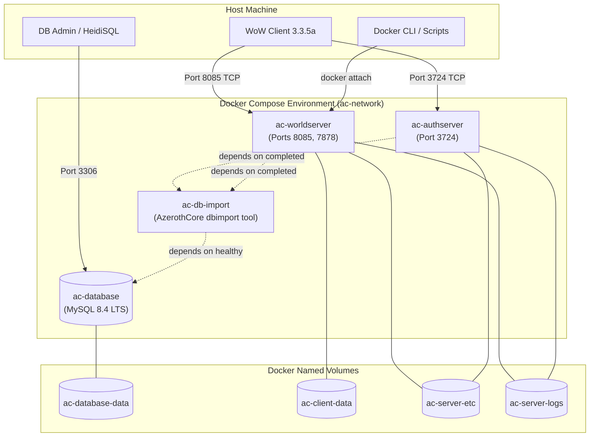

# AzerothCore WotLK (Conquest of Azeroth) - Docker Repack

A clean, reproducible, self-contained Docker-based server environment and repack for **AzerothCore WotLK** featuring the **Conquest of Azeroth (CoA)** custom class engine.

---

## 📖 Project Overview

This project provides a modern, containerized repack infrastructure for running an AzerothCore 3.3.5a World of Warcraft server with Conquest of Azeroth compatibility modules. Built from source using multi-stage Docker builds, it isolates build tools from runtime services, encapsulates service dependencies, and guarantees consistent behavior across developer and production host machines.

### Purpose

Traditional World of Warcraft private-server repacks are distributed as monolithic zip archives containing pre-extracted Windows binaries, embedded MySQL executables, and static batch files. While simple to launch on Windows, they suffer from portability issues, configuration drift, security vulnerabilities from outdated database engines, and immense difficulty when tracking upstream source updates.

**CoA-Docker** re-envisions the repack concept around Docker and Docker Compose:
- **Build from Source:** Produces optimized, reproducible Linux container images directly from the Git source tree.
- **Upstream Cleanliness:** Keeps the AzerothCore source decoupled via Git submodules, enabling simple tracking of upstream fixes.
- **Isolated Runtimes:** Minimalist, hardened runtime containers without compiler toolchains.
- **Persistent Data:** Database storage and server logs persist on managed Docker volumes independent of container lifecycles.
- **Turnkey Orchestration:** Single-command orchestration of Database, Migration/Import tool, Authentication Server, and World Server.

---

## 🚦 Current Status (Phase 1)

> [!IMPORTANT]
> **Phase 1: Build & Runtime Infrastructure**  
> This initial phase establishes the build pipelines, multi-stage Dockerfiles, Compose orchestration, volume management, and operational documentation.  
> **Not included in Phase 1:**
> - Proprietary client game data (`maps`, `vmaps`, `mmaps`, `dbc`)
> - Populated World database contents / custom gameplay SQL dumps
> - Custom gameplay `.conf` tuning overrides
> 
> These assets will be integrated in subsequent phases. In Phase 1, the infrastructure compiles the source, spins up the database, initializes the core schemas, and boots the daemons to a ready-state awaiting data.

---

## ⚙️ System Requirements

### Software Prerequisites
- **Docker Engine:** Version 24.0+ (Docker Desktop on Windows/macOS or Docker CE on Linux)
- **Docker Compose:** Version 2.20+ (Compose v2 syntax support)
- **Git:** Version 2.30+ (with submodule support)

### Hardware Expectations
- **CPU:** Minimum 2 physical cores (4+ cores recommended for parallel compilation).
- **Memory (RAM):**
  - *Build Time:* 8 GB RAM minimum (compiling Clang/C++ with LTO/PCH requires ~4-8 GB peak).
  - *Runtime:* 4 GB RAM minimum for database, authserver, and worldserver. 8 GB+ recommended once full world maps and vmaps are loaded in later phases.
- **Disk Storage:** 25 GB free space (Docker images, BuildKit compiler cache, MySQL storage, and room for future extracted maps).
- **Supported Operating Systems:** Windows 10/11 (via WSL2 engine in Docker Desktop), Linux (Ubuntu 22.04/24.04, Debian 12, Arch, RHEL 9), macOS (Apple Silicon or Intel).

---

## 🏗️ Architecture

The repack environment separates services into discrete containers connected by an isolated internal Docker bridge network:



### Components

1. **`ac-database` (MySQL 8.4 LTS):**
   - Handles `acore_auth`, `acore_characters`, and `acore_world` databases.
   - Binds persistent data to the `ac-database-data` volume.
   - Includes healthchecks ensuring the SQL engine is answering queries before dependent services proceed.

2. **`ac-db-import` (AzerothCore DBUpdater tool):**
   - Lightweight container running the compiled AzerothCore C++ `dbimport` binary.
   - Connects to `ac-database`, automatically runs database creation scripts (`data/sql/create/create_mysql.sql`), imports base tables, and applies incremental SQL updates from core and modules.
   - Shuts down gracefully upon task completion.

3. **`ac-authserver` (Realmlist & Authentication):**
   - Handles account authentication, password verification (SRP6), and realm list redirection.
   - Listens on TCP port `3724`.

4. **`ac-worldserver` (World Engine):**
   - Executes game logic, player sessions, combat mechanics, spells, and custom CoA module logic.
   - Listens on TCP port `8085` (game connection) and port `7878` (SOAP remote management).
   - Configured with `stdin_open: true` and `tty: true` to allow live host attachment to the interactive console.

---

## 📁 Project Structure

```text
CoA-Docker/
├── README.md                 # Primary project documentation (this file)
├── INSTALL.md                # Beginner-friendly step-by-step installation guide
├── docker-compose.yml        # Production Docker Compose stack definition
├── .env.example              # Environment variables template
├── .gitignore                # Git hygiene rules
├── .dockerignore             # Docker build context exclusions
├── docker/
│   └── server/
│       ├── Dockerfile        # Multi-stage build (builder, runtime, auth, world, db-import)
│       └── entrypoint.sh     # Service bootstrapping and permission validator
├── scripts/
│   ├── repack.sh             # Command-line helper for repack management
│   └── console.sh            # One-click worldserver console attach script
├── source/                   # Git submodule: AzerothCore Conquest of Azeroth source tree
└── data/                     # Host mount directory for Phase 2 game data (maps, vmaps, dbc)
```

---

## 🔨 Build Process

The server images are compiled using a multi-stage `Dockerfile` (`docker/server/Dockerfile`):

1. **Skeleton Stage:** Sets up standard directories, timezone settings (`Etc/UTC`), and non-root user `acore` (UID/GID 1000).
2. **Builder Stage:**
   - Base image: `ubuntu:24.04`.
   - Toolchain: Clang 18, CMake 3.28+, Ninja, ccache.
   - Headers: Boost 1.83, OpenSSL 3.0, MySQL 8.4 client, Readline, ncurses.
   - Compiles core server binaries (`authserver`, `worldserver`, `dbimport`, and extractors) with optimization flags (`-O2` / `RelWithDebInfo`).
   - Binaries and default configurations are installed into `/azerothcore/env/dist`.
3. **Runtime Stage:**
   - Minimalist container containing only dynamic shared runtime libraries (`libmysqlclient21`, `libreadline8`, `libssl3`, `libncurses6`).
   - Zero compilation tools, zero header packages.
   - Unprivileged execution under user `acore`.

---

## 💾 Persistent Data & Volumes

The following Docker volumes persist across container updates and restarts:

| Volume Name | Target Path | Contents |
|---|---|---|
| `ac-database-data` | `/var/lib/mysql` | MySQL database files (accounts, characters, tables). Survives container recreation. |
| `ac-client-data` | `/azerothcore/env/dist/data` | Client data files (`dbc`, `maps`, `vmaps`, `mmaps`). |
| `ac-server-etc` | `/azerothcore/env/dist/etc` | Active `.conf` configuration files. |
| `ac-server-logs` | `/azerothcore/env/dist/logs` | Server log files generated by authserver and worldserver. |

> [!CAUTION]
> Running `docker compose down` stops and removes containers while preserving persistent volumes.  
> Running `docker compose down -v` permanently **DELETES** named volumes, destroying all database data.

---

## 🌐 Network Ports

| Port | Protocol | Scope | Purpose |
|---|---|---|---|
| `3306` | TCP | Host / Configurable | External MySQL access (HeidiSQL, DBeaver, Navicat). Can be disabled or changed in `.env`. |
| `3724` | TCP | Public | Authentication Server (WoW realmlist login port). |
| `8085` | TCP | Public | World Server (Game client realm connection). |
| `7878` | TCP | Host / Private | SOAP Management Interface (optional, for web portals or remote commands). |

---

## 📋 Lifecycle Commands

Execute all commands from the repository root:

### Quickstart
```bash
# 1. Copy the environment file
cp .env.example .env

# 2. Build the Docker images
docker compose build

# 3. Start the stack in background
docker compose up -d

# 4. View real-time logs
docker compose logs -f
```

### Server Management
- **View Container Status:**
  ```bash
  docker compose ps
  ```
- **Stop Server Gracefully:**
  ```bash
  docker compose stop
  ```
- **Restart Stack:**
  ```bash
  docker compose restart
  ```
- **Attach to Worldserver Interactive Console:**
  ```bash
  docker attach ac-worldserver
  # Detach without killing the container: press CTRL+P followed by CTRL+Q
  ```
  *(Or run `./scripts/console.sh`)*

- **Rebuild After Source Modifications:**
  ```bash
  docker compose build ac-worldserver
  docker compose up -d ac-worldserver
  ```

- **Tear Down Containers (Safely Preserving Data):**
  ```bash
  docker compose down
  ```

---

## 🩺 Troubleshooting

### 1. `ac-worldserver` Exits Immediately
- In Phase 1, `worldserver` will exit if it requires DBC or map files that have not yet been mounted. This is expected until Phase 2 is completed.
- Inspect logs to confirm:
  ```bash
  docker compose logs ac-worldserver
  ```

### 2. Database Connection Refused
- Ensure the MySQL database container is healthy:
  ```bash
  docker compose ps ac-database
  ```
- If the container is still initializing, wait 15-30 seconds for the first-time table initialization to finish.

### 3. Submodule Directory Is Empty
- If `source/` is empty after cloning, initialize it:
  ```bash
  git submodule update --init --recursive
  ```

---

## 🔮 Future Phases Roadmap

- **Phase 2:**
  - Client data extraction pipeline and volume integration (`dbc`, `maps`, `vmaps`, `mmaps`).
  - World database importation with full Conquest of Azeroth content baseline.
  - Production-ready `worldserver.conf` and `authserver.conf` defaults.
- **Phase 3:**
  - One-click account creation scripts and automatic realm IP configuration.
  - Web dashboard / automated health monitoring tools.
